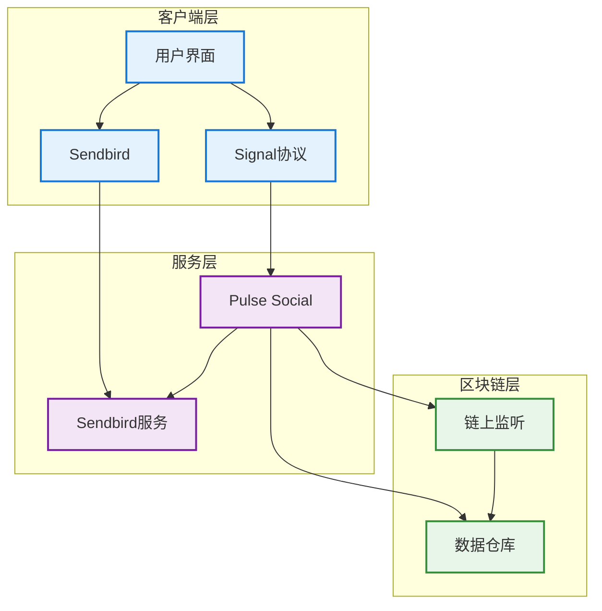
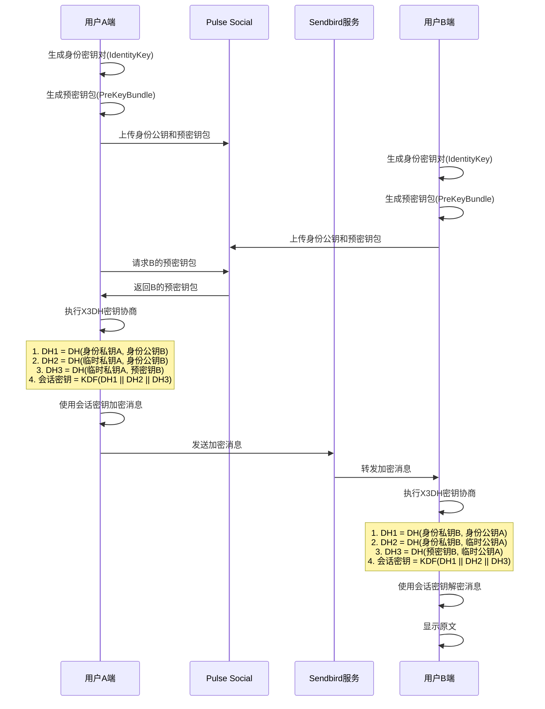
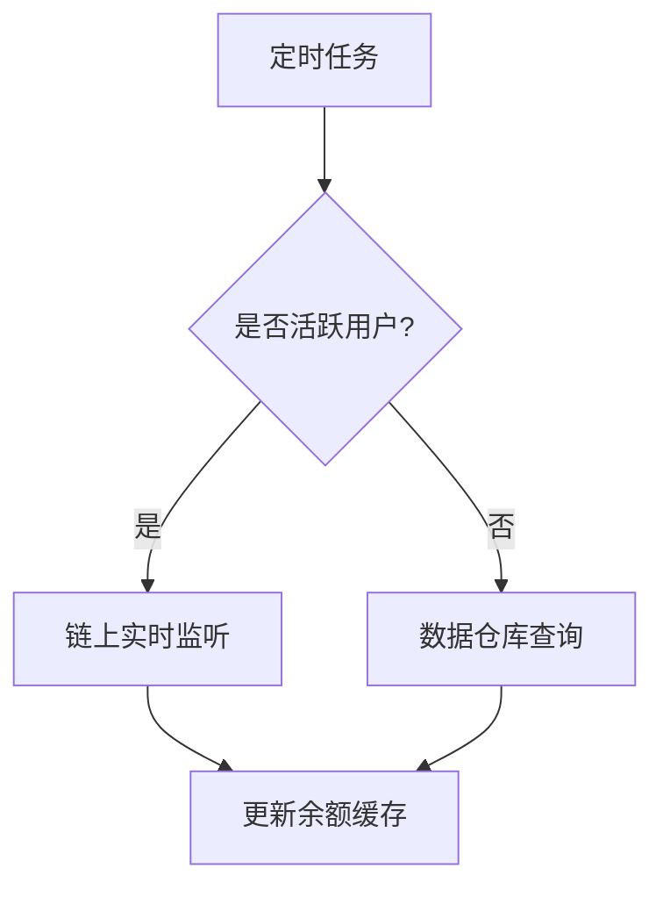

# Web3 DM聊天系统设计方案

## 1. 概述
本文档描述基于Sendbird实现的Web3 DM单聊功能，集成Signal协议实现端到端加密，并支持基于用户AA钱包余额的功能。

## 2. 功能需求
- 单聊通信：通过sendbird传递秘文
- 消息端到端加密： 通过signal协议加密，后端实现公钥/预密钥分发
- 聊天列表： 群聊/单聊混排
- 单聊关系维护：
    - follow关系
    - 已有聊天：要支持是否显示控制
- 聊天发起
    - 目标用户搜索&排序
    - 新发的单聊：相当于建组和消息同时触发，接收端实时通知机制
- 用户封禁：封禁后，直接在对应senbird群组中设置禁言。
- 聊天限制：只有满足条件，才会授予在senbird群组发言的权限。
- 用户钱包余额查询
- 消息历史记录：依然从sendbird拉取，但都是秘文，无法查看，只能用作统计

## 3. 非功能需求
- 消息实时性
- 数据安全性
- 系统可用性
- 扩展性

## 4. 系统架构

### 4.1 整体架构图

### 4.2 组件说明
1. 客户端层
   - 用户界面：消息展示与交互
   - Signal协议：端到端加密
   - Sendbird：消息收发

2. 服务层
   - Pulse Social：核心业务服务
   - Sendbird服务：消息基础设施

3. 区块链层
   - 链上监听：实时数据同步
   - 数据仓库：历史数据存储

### 4.3 端加密消息通信流程

### 4.4 钱包余额查询流程

## 5. 技术方案

### 5.1 消息加密方案
- 使用Signal Protocol实现端到端加密
- 每个会话生成唯一的会话密钥
- 支持消息前向安全性
- 密钥协商使用X3DH协议

### 5.2 钱包余额监控方案
1. 实时监听：
   - 监听活跃用户的钱包地址
   - 使用WebSocket订阅链上事件
   - 实时更新余额缓存

2. 定时查询：
   - 每小时从数据仓库同步非活跃用户余额
   - 使用批量查询优化性能
   - 设置余额更新阈值

## 6. 功能设计

### 6.1 单聊通信
- 通过sendbird传递秘文
- 本次在senbird新增application，和之前的群里区分开来
- 单聊组信息获取接口
    - 入参
        - 目标用户ID
    - 出参
        - channel_url
### 6.2 消息端到端加密
 - 通过signal协议加密，后端实现公钥/预密钥分发
 - 
### 6.3 聊天列表
 群聊/单聊混排
### 6.4 单聊关系维护
    - follow关系
    - 已有聊天：要支持是否显示控制
### 6.5 聊天发起
    - 目标用户搜索&排序
    - 新发的单聊：相当于建组和消息同时触发，接收端实时通知机制
### 6.6 用户封禁
封禁后，直接在对应senbird群组中设置禁言。
### 6.7 聊天限制
只有满足条件，才会授予在senbird群组发言的权限。
### 6.8 用户钱包余额查询
### 6.9 消息历史记录
依然从sendbird拉取，但都是秘文，无法查看，只能用作统计

## 7. 安全考虑
- 消息全程加密
- 私钥本地存储
- 定期轮换会话密钥
- 防重放攻击
- 钱包地址验证

## 8. 性能优化
- 消息缓存策略
- 余额查询批处理
- 链上事件过滤
- 连接池管理
- 数据预加载

## 9. 部署方案
- 使用容器化部署
- 多区域部署
- 负载均衡
- 故障转移
- 监控告警

## 10. 后续规划
- 群聊支持
- 富媒体消息
- 消息回执
- 更多钱包集成
- 性能优化

