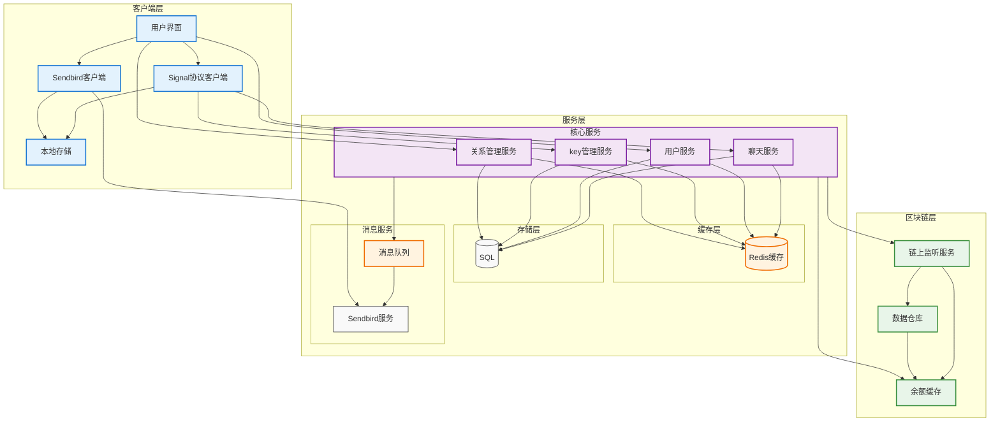
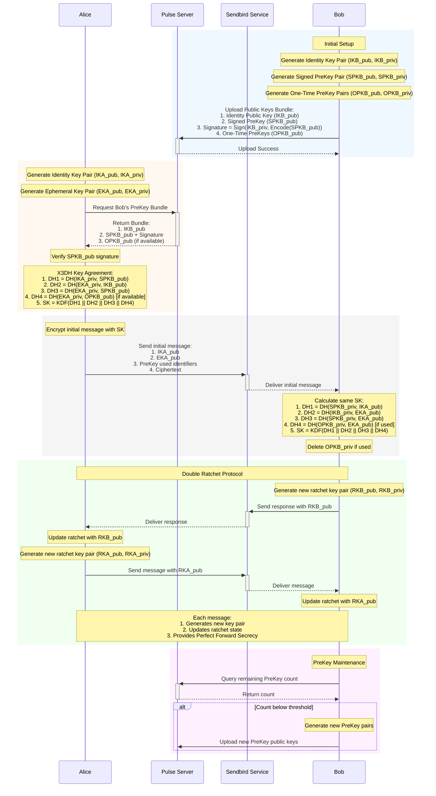
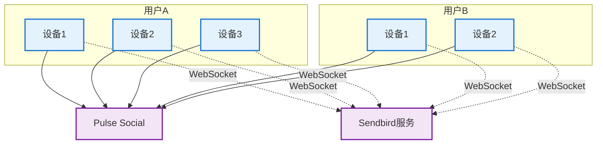
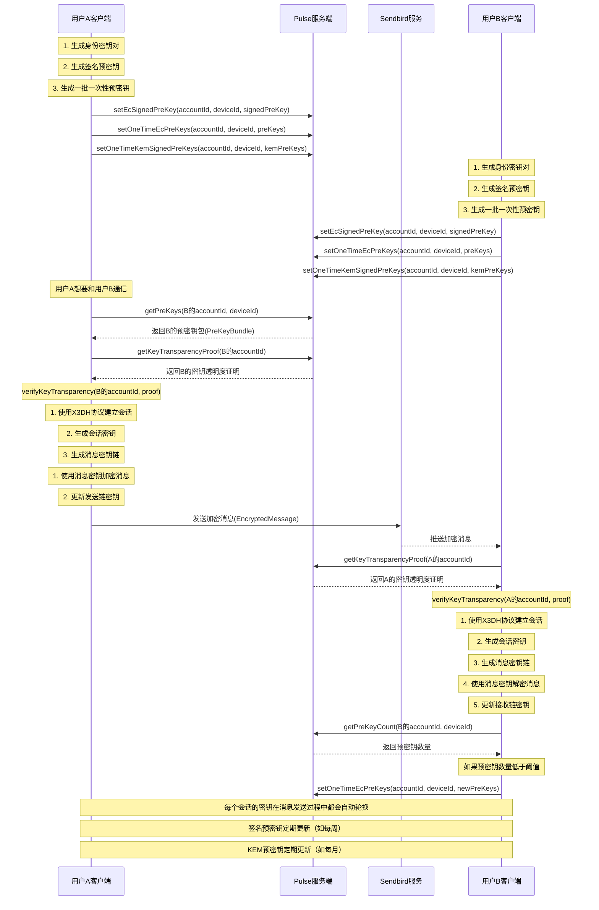
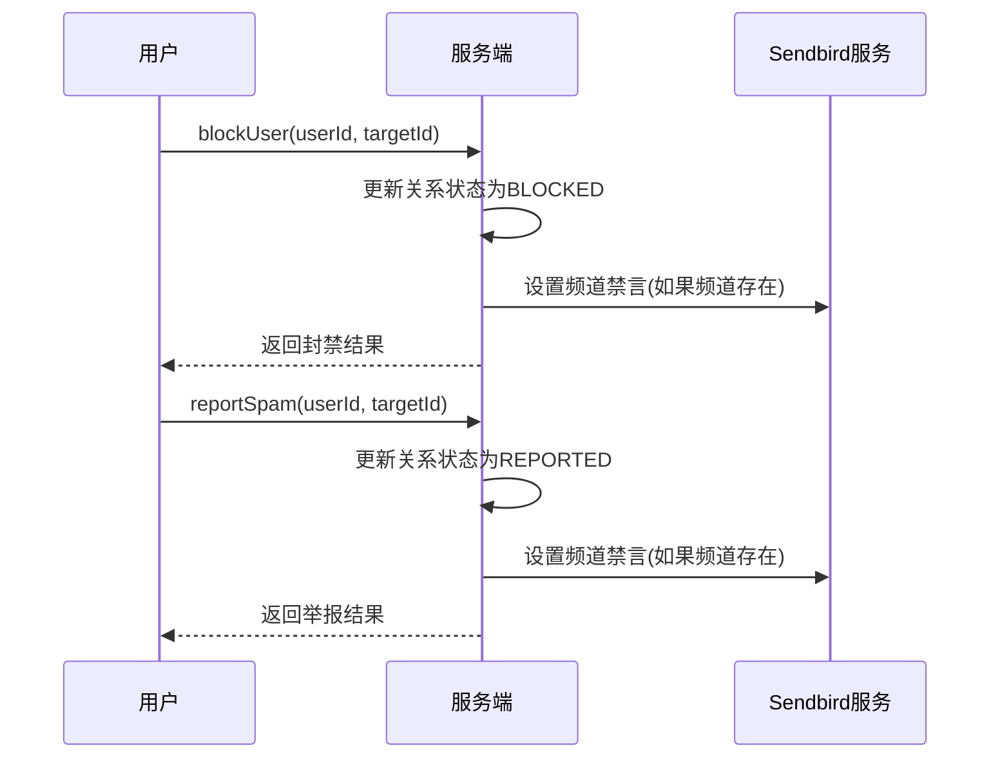
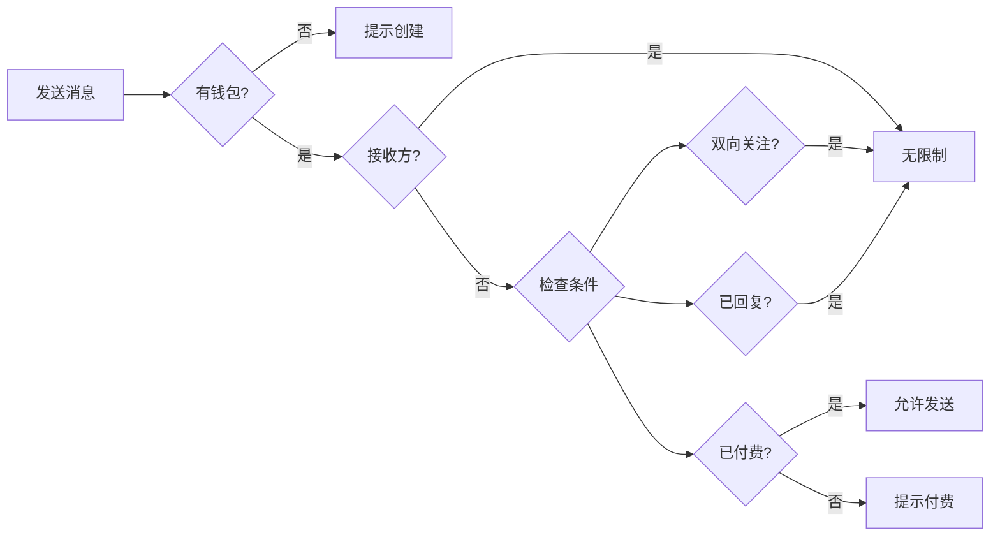
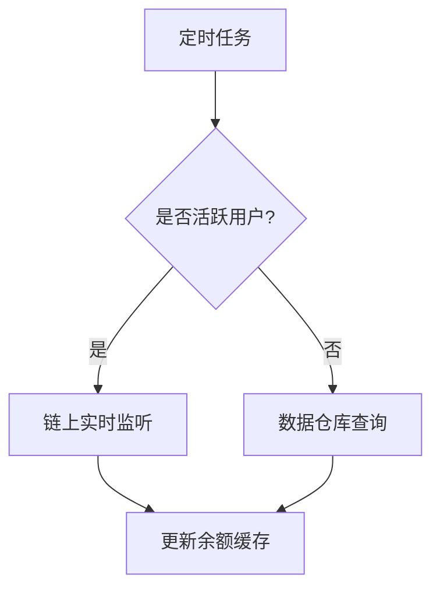

# Web3 DM聊天系统设计方案

## 1. 概述
本文档描述基于Sendbird实现的Web3 DM单聊功能，集成Signal Protocol实现End-to-End Encryption，并支持基于用户AA钱包余额的功能。

## 2. 功能需求

### 2.1 基础功能
- 基于Sendbird的端到端加密单聊
- Signal Protocol key 存储/维护/分发
- 多设备激活管理
- 实时消息推送

### 2.2 聊天管理
- 群聊/单聊混合列表
- 置顶/归档/隐藏会话

### 2.3 用户关系
- 关注/取消关注
- 用户封禁
- 垃圾信息举报
- 关系状态查询

### 2.4 权限控制
- 钱包绑定验证
- 付费解锁聊天
- 双向关注特权
- Sendbird频道权限

### 2.5 系统集成
- 钱包余额监控
- Pulse记录管理
- Push通知服务

## 3. 非功能需求
- 消息实时性
- 数据安全性
- 系统可用性
- 扩展性

## 4. 系统架构

### 4.1 整体架构图


### 4.2 组件说明
1. 客户端层
   - 用户界面：消息展示与交互
   - Signal协议：端到端加密
   - Sendbird：消息收发

2. 服务层
   - Pulse Social：核心业务服务
   - Sendbird服务：消息基础设施

3. 区块链层
   - 链上监听：实时数据同步
   - 数据仓库：历史数据存储


### 4.3 End-to-End Encryption Message Flow


## 5. 技术方案

### 5.1 消息加密方案

#### 5.1.1 核心机制
- 基于Signal Protocol的端到端加密（E2EE）实现
- 采用双棘轮（Double Ratchet）算法，确保消息前向安全性
- 使用X3DH（Extended Triple Diffie-Hellman）密钥协商机制
- 支持异步消息加密，适应多设备场景

#### 5.1.2 安全特性
- 完美前向保密（Perfect Forward Secrecy）
- 中间人攻击防护
- 消息完整性校验
- 支持未来量子计算防护

### 5.2 钱包余额监控方案
1. 实时监听：
   - 监听活跃用户的钱包地址
   - 使用WebSocket订阅链上事件
   - 实时更新余额缓存

2. 定时查询：
   - 每小时从数据仓库同步非活跃用户余额
   - 使用批量查询优化性能
   - 设置余额更新阈值


## 6. 功能设计

### 6.1 单聊通信

#### 6.1.1 多设备通信架构
多设备支持主要基于以下原则:
1. 每个用户可以注册多个设备
2. 每个设备都有独立的密钥对
3. 消息可以分别加密发送给接收方的每个设备，本次只发送指定的激活设备
4. 每个设备独立维护自己的会话状态
5. 服务端会为每一对设备维护一个senbird channel




#### 6.1.2 设备注册与管理
1. **设备注册流程**
   ```mermaid
   sequenceDiagram
       participant Device as 新设备
       participant Server as Pulse服务端
       participant Sendbird as Sendbird服务
       
       Device->>Server: 请求注册新设备
       Note over Device: 生成设备ID和注册ID
       Note over Device: 生成身份密钥对
       Device->>Server: 上传设备信息(deviceRegistration)
       Server->>Sendbird: 择机创建设备对应的聊天频道
       Server-->>Device: 返回注册结果
       Note over Device: 存储本地密钥
   ```
    - 择机创建设备对应的聊天频道
        - 用户使用新设备选择具体人发起聊天时
        - 用户被选择发起聊天时。(前提都是有发言的权限)

2. **设备信息收集**
   - 时机：
     * 用户绑定AA钱包
     * 用户进入聊天页面
   - 收集内容：
     * 设备唯一标识符
     * 设备类型(iOS/Android/Desktop)
     * 操作系统版本
     * 应用版本
     * 推送令牌
     * 设备注册ID

#### 6.1.3 设备安全机制
1. **密钥管理**
   - 每个设备独立生成和管理密钥
   - 密钥永不离开设备
   - 不支持密钥备份和恢复
   - 设备丢失意味着消息历史丢失

2. **设备丢失处理**
   - 远程撤销设备授权
   - 通知其他设备该设备已失效(禁用与丢失设备相关的所有频道)
   - 重新建立新的会话
   - 旧设备的消息无法恢复

3. **安全考虑**
   - 每个设备的会话独立加密
   - 不同设备间的消息互不可见
   - 设备丢失不影响其他设备的安全性

#### 6.1.4 频道信息查询接口 (getChannelInfo)
**使用场景**：
- 当用户需要与其他用户通信时，查询对应设备的Sendbird频道信息，用于建立WebSocket连接。
- 注意这个服务调用，会触发sendbird channel创建。在用户还没有满足发送消息条件时，这个接口返回的信息中，没有sendbird channel。

| 参数 | 类型 | 说明 |
|------|------|------|
| userId | String | 用户ID |
| deviceId | String | 设备ID |
| targetUserId | String | 目标用户ID |
| 返回值 | ChannelInfo | 频道信息响应 |

ChannelInfo 对象字段说明：
```json
{
    "applicationId": "Sendbird应用ID",
    "channelUrl": "频道URL",
    "imUserId": "设备对应的Sendbird用户ID",
    "sessionToken": "访问令牌",
    "targetImUserId": "目标设备的Sendbird用户ID",
    "customType": "频道类型标识",
    "metadata": {
        "encryptionEnabled": true,
        "deviceInfo": {
            "deviceId": "目标设备ID（当前激活设备）",
            "deviceType": "设备类型"
        }
    }
}
```

#### 6.1.5 设备注册接口 (deviceRegistration)
**使用场景**：用户在新设备上首次使用应用时，需要注册设备信息和密钥信息。

| 参数 | 类型 | 说明 |
|------|------|------|
| userId | String | 用户ID |
| deviceInfo | DeviceInfo | 设备信息对象 |
| 返回值 | DeviceRegistrationResponse | 设备注册响应 |

DeviceInfo 对象字段说明：
```json
{
    "deviceId": "设备唯一标识符",
    "deviceType": "设备类型(iOS/Android/Desktop)",
    "osVersion": "操作系统版本",
    "appVersion": "应用版本号",
    "pushToken": "推送通知令牌",
    "registrationId": "Signal协议注册ID"，
    "identityPublicKey": "Identity Public Key"
}
```
DeviceRegistrationResponse 对象字段说明：
```json
{
    "deviceId": "已注册的设备ID",
    "registrationStatus": "注册状态",
    "keyBundleStatus": "密钥包注册状态",
    "linkedDevices": [{
        "deviceId": "关联设备ID",
        "deviceType": "设备类型",
        "lastActiveAt": "最后活跃时间"
    }]
}
```

#### 6.1.6 消息传输流程
1. **建立连接**
   ```mermaid
   sequenceDiagram
       participant Device as 发送方设备
       participant Server as Pulse服务端
       participant Sendbird as Sendbird服务
       participant Target as 接收方设备
       
       Device->>Server: getChannelInfo(userId, deviceId, targetId, targetDeviceId)
       Server-->>Device: 返回频道信息
       Device->>Sendbird: 建立WebSocket连接
       
       Target->>Server: getChannelInfo(targetId, targetDeviceId, userId, deviceId)
       Server-->>Target: 返回频道信息
       Target->>Sendbird: 建立WebSocket连接
   ```

2. **消息发送流程**
   - 发送方获取接收方所有活跃设备列表
   - 对每个目标设备：
     * 使用目标设备的公钥加密消息
     * 通过对应的Sendbird频道发送加密消息
   - 接收方设备：
     * 监听各自的Sendbird频道
     * 使用自己的私钥解密消息
     * 本地存储解密后的消息

3. **实现细节**
   - 每个设备独立维护会话状态
   - 消息通过Sendbird WebSocket实时推送
   - 服务端不存储任何密钥和消息明文
   - 频道信息按需查询，不做本地持久化

#### 6.1.7 设备激活逻辑
待确定

### 6.2 消息端到端加密
- 通过signal协议加密，后端实现公钥/预密钥分发
- 下图展示了两个用户之间建立加密通信的完整流程：



#### 6.2.1 Get PreKey Bundle (getPreKeys)
**使用场景**：当用户A想要与用户B开始加密通信时，需要先获取用户B的 PreKey Bundle，用于建立安全的通信会话。通常在首次通信或会话密钥需要更新时调用。

| 参数 | 类型 | 说明 |
|------|------|------|
| targetIdentifier | ServiceIdentifier | 目标用户的服务标识符，包含身份类型和UUID |
| deviceId | Optional<uint32> | 设备ID，如果不指定则返回所有设备的 PreKey Bundle |
| 返回值 | GetPreKeysResponse | PreKey Bundle Response |

GetPreKeysResponse 对象字段说明：
```json
{
    "identityKey": "bytes", // Identity Public Key
    "preKeys": {
        "deviceId": { // key为设备ID
            "ecSignedPreKey": { // EC Signed PreKey, required
                "keyId": "int",
                "publicKey": "bytes", // EC Public Key
                "signature": "bytes"  // Signature by Identity Key
            },
            "ecOneTimePreKey": { // EC One-Time PreKey, optional (may be empty if used)
                "keyId": "int",
                "publicKey": "bytes"  // EC Public Key
            },
            "kemOneTimePreKey": { // KEM One-Time PreKey, returns Last Resort PreKey if no One-Time PreKey available
                "keyId": "int", 
                "publicKey": "bytes",  // KEM Public Key
                "signature": "bytes"   // Signature by Identity Key
            }
        }
    }
}
```

**PreKey Availability**：
1. EC Signed PreKey: Each device must have a valid Signed PreKey for initial session establishment
2. EC One-Time PreKey: Returns one if available, empty if all used
3. KEM One-Time PreKey: Prioritizes One-Time KEM PreKey, falls back to Last Resort PreKey if none available

**注意事项**：
1. One-Time PreKeys (EC and KEM) can only be used once
2. Signed PreKey can be reused but should be rotated periodically
3. When One-Time PreKeys are exhausted, system falls back to using Signed PreKey
4. KEM PreKey provides post-quantum protection

#### 6.2.2 Get PreKey Count (getPreKeyCount)
**使用场景**：服务器需要定期检查用户的可用 PreKey 数量，当数量低于阈值时通知客户端生成新的 PreKey。这是确保系统始终有足够的 PreKey 可用的关键监控接口。

| 参数 | 类型 | 说明 |
|------|------|------|
| 无 | - | 使用认证信息识别设备 |
| 返回值 | GetPreKeyCountResponse | PreKey Count Response |

GetPreKeyCountResponse 对象字段说明：
```json
{
    "ecPreKeyCount": "int",  // EC PreKey count
    "kemPreKeyCount": "int" // KEM PreKey count
}
```

#### 6.2.3 Set EC One-Time PreKeys (setOneTimeEcPreKeys)
**使用场景**：当用户首次注册设备或 PreKey 数量不足时，客户端会生成一批新的 EC PreKey 并上传到服务器。支持批量设置以提高效率。

| 参数 | 类型 | 说明 |
|------|------|------|
| preKeys | List<EcPreKey> | EC PreKey List |
| 返回值 | SetPreKeyResponse | Empty response indicates success |

EcPreKey 对象字段说明：
```json
{
    "keyId": "int",
    "publicKey": "bytes"  // EC Public Key
}
```

#### 6.2.4 Set EC Signed PreKey (setEcSignedPreKey)
**使用场景**：用户需要定期更新 EC Signed PreKey 以增强安全性。与 One-Time PreKey 不同，Signed PreKey 可以重复使用，但建议定期轮换（如每周）。

| 参数 | 类型 | 说明 |
|------|------|------|
| signedPreKey | EcSignedPreKey | EC Signed PreKey Object |
| 返回值 | SetPreKeyResponse | Empty response indicates success |

EcSignedPreKey 对象字段说明：
```json
{
    "keyId": "int",
    "publicKey": "bytes",  // EC Public Key
    "signature": "bytes"   // Signature by Identity Key
}
```

#### 6.2.5 Set KEM One-Time PreKeys (setOneTimeKemSignedPreKeys)
**使用场景**：为支持后量子加密，用户需要设置一批 KEM PreKey。这些 PreKey 提供抗量子计算攻击的能力。支持批量设置。

| 参数 | 类型 | 说明 |
|------|------|------|
| preKeys | List<KemSignedPreKey> | KEM Signed PreKey List |
| 返回值 | SetPreKeyResponse | Empty response indicates success |

KemSignedPreKey 对象字段说明：
```json
{
    "keyId": "int",
    "publicKey": "bytes",  // KEM Public Key
    "signature": "bytes"   // Signature by Identity Key
}
```

注意事项：
1. KEM PreKey uses post-quantum secure algorithm (e.g., Kyber-1024)
2. Each KEM PreKey can only be used once
3. Server maintains KEM PreKey usage status
4. Recommended parameters:
   - Batch upload size: 20
   - Minimum available threshold: 5

#### 6.2.6 Get Key Transparency Proof (getKeyTransparencyProof)
**使用场景**：当用户需要验证其他用户的 Identity Key 是否可信时使用。这通常发生在首次通信或检测到对方 Key 变更时，用于防止中间人攻击。

| 参数 | 类型 | 说明 |
|------|------|------|
| accountId | String | 账户ID，要获取证明的目标用户 |
| 返回值 | KeyTransparencyProof | Key Transparency Proof Object |

KeyTransparencyProof 对象字段说明：
```json
{
    "accountId": "账户ID",
    "keyHistory": [{
        "identityKey": "Identity Public Key",
        "timestamp": "使用时间戳"
    }],
    "proof": {
        "merkleRoot": "Merkle Tree Root Hash",
        "merkleProof": "Merkle Inclusion Proof",
        "signature": "Server Signature"
    }
}
```

#### 6.2.7 Verify Key Transparency Proof (verifyKeyTransparency)
**使用场景**：收到其他用户的 Key Transparency Proof 后，需要验证其有效性。这是确保通信安全的关键步骤，可以检测是否存在恶意的 Key 替换。

| 参数 | 类型 | 说明 |
|------|------|------|
| accountId | String | 账户ID，要验证证明的用户 |
| proof | KeyTransparencyProof | Key Transparency Proof to verify |
| 返回值 | boolean | Verification result: true-valid, false-invalid |

#### 6.2.8 发送加密消息(走sendbird订阅，这里只是例子)
**使用场景**：用户A要向用户B发送加密消息时调用。消息在客户端使用会话密钥加密后，通过该接口发送给服务器。

| 参数 | 类型 | 说明 |
|------|------|------|
| accountId | String | 接收方账户ID |
| deviceId | int | 接收方设备ID |
| message | EncryptedMessage | 加密后的消息对象 |
| 返回值 | void | 无返回值 |

EncryptedMessage 对象字段说明：
```json
{
    "messageId": "Message Unique Identifier",
    "senderId": "Sender Account ID",
    "senderDeviceId": "Sender Device ID",
    "ciphertext": "Encrypted Message Content",
    "messageType": "Message Type (Text/Image/File etc.)",
    "timestamp": "Sent Timestamp",
    "ephemeralKey": "Ephemeral Public Key (if used)",
    "messageNumber": "Message Sequence Number (for replay protection)"
}
```

#### 6.2.9 接收加密消息(走sendbird订阅，这里只是例子)
**使用场景**：用户B定期检查或实时获取发送给自己的加密消息。获取到的消息需要使用对应的会话密钥在客户端解密。

| 参数 | 类型 | 说明 |
|------|------|------|
| accountId | String | 接收方账户ID |
| deviceId | int | 接收方设备ID |
| 返回值 | List<EncryptedMessage> | 加密消息列表 |

以上接口共同构成了完整的端到端加密消息传输体系：
1. 通过预密钥管理（6.2.1-6.2.5）确保安全的密钥交换
2. 使用密钥透明度证明（6.2.6-6.2.7）保证密钥的可信度
3. 实现加密消息的发送和接收（6.2.8-6.2.9）

错误处理：
所有接口可能抛出的异常包括：
```json
{
    "KeyNotFoundException": "Requested key not found",
    "KeyValidationException": "Key validation failed",
    "DeviceNotFoundException": "Specified device not found",
    "QuotaExceededException": "Quota limit exceeded",
    "InvalidParameterException": "Invalid parameters",
    "AuthenticationException": "Authentication failed",
    "ServerException": "Internal server error"
}
```

#### 6.2.0 PreKey Management Mechanism

1. **PreKey Quota**
   ```json
   {
       "maxPreKeysPerDevice": 100,    // Maximum PreKeys per device
       "minPreKeysThreshold": 20,     // Minimum threshold
       "batchUploadSize": 50,         // Batch upload size
       "preKeyTTL": 604800,          // PreKey TTL (7 days)
       "signedPreKey": {
           "rotationInterval": 604800  // Signed PreKey rotation interval (7 days)
       }
   }
   ```

2. **PreKey Status**
   ```json
   {
       "AVAILABLE": "Available",
       "USED": "Used",
       "EXPIRED": "Expired"
   }
   ```

3. *客户端主动管理机制**
   - Client is responsible for generating and managing all keys
   - Client checks PreKey count at:
     * Application startup
     * Before sending/receiving messages
     * Periodic checks (e.g., daily)
   - When PreKey count is below threshold, client automatically generates and uploads new PreKeys

4. **服务端职责**
   - Acts only as key distribution center
   - Stores and distributes PreKey Bundles
   - Maintains PreKey usage status
   - Provides PreKey count query interface

5. **PreKey Distribution Flow**
   ```mermaid
   sequenceDiagram
       participant A as Sender
       participant Server as Key Server
       participant B as Receiver
       
       B->>B: Generate PreKeys
       B->>Server: Upload PreKey Bundle
       
       A->>Server: Request B's PreKey
       alt Available One-Time PreKey
           Server-->>A: Return One-Time PreKey Bundle
           Server->>Server: Mark PreKey as used
       else One-Time PreKeys exhausted
           Server-->>A: Return Signed PreKey Bundle
       end
       
       B->>Server: Query PreKey count
       Server-->>B: Return available count
       Note over B: If count below threshold
       B->>B: Generate new PreKeys
       B->>Server: Upload new PreKey Bundle
   ```

6. **Key Generation Rules**
   - Identity Key Pair: Generated at device first registration
   - Signed PreKey: Each device maintains one active Signed PreKey, rotated periodically (weekly)
   - One-Time PreKey Pairs: Batch generated to maintain sufficient supply

7. **PreKey Exhaustion Handling**
   - Normal Mode: Using One-Time PreKey
     * Prioritize One-Time PreKey for session establishment
     * Each PreKey used only once for optimal security
   
   - Fallback Mode: Using Signed PreKey
     * Use Signed PreKey when One-Time PreKeys exhausted
     * Multiple sessions can share same Signed PreKey
     * Still maintains Forward Secrecy
   
   - Emergency Mode: Device Offline
     * When device is offline and Signed PreKey expires
     * Server marks device as "Needs Re-registration"
     * New session attempts return error
     * Device must generate and upload new PreKey Bundle upon reconnection
     * UI shows "Waiting for device to come online"

   - Security Considerations:
     * Signed PreKey verified by Identity Key signature
     * Regular Signed PreKey rotation reduces risk
     * Block new sessions when offline rather than compromise security

### 6.3 聊天列表

#### 6.3.1 聊天列表数据结构
**ChatItem 对象字段说明：**
```json
{
    "id": "聊天项ID",
    "chatType": "聊天类型(GROUP/PRIVATE)",
    "channelUrl": "Sendbird频道URL",
    "name": "显示名称",
    "profileUrl": "头像URL",
    "backdropUrl": "背景图URL",
    "pinned": "是否置顶",
    "latestMessageId": "最新消息ID",
    "latestMessageTime": "最新消息时间",
    "unreadCount": "未读消息数",
    "status": "状态(ACTIVE/ARCHIVED)",
    "metadata": {
        "groupInfo": {  // 群聊特有字段
            "managerUserId": "管理员用户ID",
            "memberCount": "成员数量",
            "dayAllowance": "日限额",
            "assetAmount": "资产金额",
            "groupCategory": "群组类别",
            "chainName": "链名称",
            "tokenAddress": "代币地址",
            "joinConditions": "加入条件",
            "supplier": "供应商"
        },
        "privateInfo": {  // 单聊特有字段
            "targetUserId": "目标用户ID",
            "encryptionEnabled": true,
            "followStatus": "关注状态"
        }
    }
}
```

#### 6.3.2 获取聊天列表接口 (getChatList)
**使用场景**：
- 获取用户的聊天列表，包含群聊和单聊。按最新消息时间倒序排列。
- 由于Web端不支持单聊，不能复用以前，这个接口为新增。

| 参数 | 类型 | 说明 |
|------|------|------|
| userId | String | 用户ID |
| filter | ChatFilter | 过滤条件 |
| 返回值 | ChatListResponse | 聊天列表响应 |

ChatFilter 对象字段说明：
```json
{
    "chatTypes": ["GROUP", "PRIVATE"],
    "status": ["ACTIVE", "ARCHIVED"],
    "showHidden": false
}
```

ChatListResponse 对象字段说明：
```json
{
    "items": [ChatItem]
}
```

#### 6.3.3 聊天项更新接口 (updateChatItem)
**使用场景**：更新聊天列表中的项目属性，如置顶、隐藏等。

| 参数 | 类型 | 说明 |
|------|------|------|
| userId | String | 用户ID |
| chatId | String | 聊天项ID |
| updates | ChatItemUpdates | 更新内容 |
| 返回值 | boolean | 更新结果 |

ChatItemUpdates 对象字段说明：
```json
{
    "pinned": "是否置顶",
    "hidden": "是否隐藏",
    "status": "状态(ACTIVE/ARCHIVED)"
}
```

### 6.4 单聊关系管理

#### 6.4.1 关系存储设计

1. **用户关系表(user_relationships)**

| 字段名 | 类型 | 说明 | 索引 |
|-------|------|------|------|
| id | bigint | 主键 | PK |
| user_id | varchar(64) | 发起方用户ID | IDX |
| target_user_id | varchar(64) | 接收方用户ID | IDX |
| relation_status | varchar(20) | 关系状态(FOLLOWING/BLOCKED/REPORTED) | - |
| created_at | timestamp | 创建时间 | - |
| updated_at | timestamp | 更新时间 | - |
| metadata | jsonb | 扩展信息 | - |

联合唯一索引: (user_id, target_user_id)

metadata字段示例：
```json
{
    "blockInfo": {
        "reason": "封禁原因",
        "blockedAt": "封禁时间",
        "expireAt": "封禁过期时间（可选）",
        "sendbirdChannelStatus": "频道状态"
    },
    "reportInfo": {
        "reason": "举报原因",
        "reportedAt": "举报时间",
        "spamType": "垃圾信息类型",
        "chatId": "相关聊天室ID",
        "evidenceUrls": ["证据图片/视频URL"]
    },
    "followInfo": {
        "isFollowBack": "是否互相关注",
        "lastInteractionAt": "最后互动时间",
        "chatPreference": "聊天偏好设置"
    }
}
```

2. **用户关系统计表(user_relationship_stats)**

| 字段名 | 类型 | 说明 | 索引 |
|-------|------|------|------|
| user_id | varchar(64) | 用户ID | PK |
| following_count | int | 关注数 | - |
| followers_count | int | 粉丝数 | - |
| mutual_count | int | 互关数 | - |
| blocked_count | int | 封禁数 | - |
| reported_count | int | 举报数 | - |
| updated_at | timestamp | 更新时间 | - |

3. **关系状态说明**

- FOLLOWING: 正常关注关系
- BLOCKED: 已封禁状态，无法互相发送消息
- REPORTED: 已举报状态，等待处理

4. **数据一致性保证**
- 使用事务确保关系表和统计表的同步更新
- 定期运行统计修复任务
- 缓存热点数据提升查询性能

5. **扩展性考虑**
- metadata使用jsonb类型，支持动态扩展字段
- 预留relation_status其他状态值
- 支持添加更多统计维度

#### 6.4.2 关系管理接口

1. **关注用户 (followUser)**

| 参数 | 类型 | 说明 |
|------|------|------|
| userId | String | 当前用户ID |
| targetUserId | String | 目标用户ID |
| 返回值 | FollowResponse | 关注结果响应 |

FollowResponse 对象字段说明：
```json
{
    "followStatus": "关注状态(FOLLOWING/BLOCKED)",
    "timestamp": "关注时间",
    "metadata": {
        "isFollowBack": "是否互相关注"
    }
}
```

2. **取消关注 (unfollowUser)**

| 参数 | 类型 | 说明 |
|------|------|------|
| userId | String | 当前用户ID |
| targetUserId | String | 目标用户ID |
| 返回值 | boolean | 取消关注结果 |

3. **获取关系状态 (getRelationship)**

| 参数 | 类型 | 说明 |
|------|------|------|
| userId | String | 当前用户ID |
| targetUserId | String | 目标用户ID |
| 返回值 | RelationshipInfo | 关系信息 |

RelationshipInfo 对象字段说明：
```json
{
    "followStatus": "关注状态",
    "chatStatus": "聊天状态",
    "lastInteractionAt": "最后互动时间",
    "blockStatus": "拦截状态"
}
```

#### 6.4.3 用户搜索接口 (searchUsers)
**使用场景**：
- 搜索可能的聊天对象。
- 只有初始上传了设备信息和prekey bundle的用户才能查询到

| 参数 | 类型 | 说明 |
|------|------|------|
| keyword | String | 搜索关键词 |
| filter | UserSearchFilter | 搜索过滤条件 |
| pageSize | int | 分页大小 |
| cursor | String | 分页游标 |
| 返回值 | UserSearchResponse | 用户搜索结果 |

UserSearchFilter 对象字段说明：
```json
{
    "followStatus": ["FOLLOWING", "FOLLOWERS", "MUTUAL"]
}
```

**默认排序规则**：
1. 互相关注的用户优先，按资产金额从高到低
2. 已关注用户次之，按资产金额从高到低
3. 未关注用户最后，按资产金额从高到低

#### 6.4.4 用户封禁与举报管理

1. **关系存储**
在user_relationships表

2. **封禁用户接口 (blockUser)**

| 参数 | 类型 | 说明 |
|------|------|------|
| userId | String | 当前用户ID |
| targetUserId | String | 目标用户ID |
| reason | String | 封禁原因（可选） |
| 返回值 | BlockResponse | 封禁结果响应 |

BlockResponse 对象字段说明：
```json
{
    "status": "封禁状态(SUCCESS/FAILED)",
    "timestamp": "操作时间",
    "metadata": {
        "chatRoomStatus": "聊天室状态",
        "sendbirdStatus": "Sendbird频道状态"
    }
}
```

3. **举报垃圾信息接口 (reportSpam)**

| 参数 | 类型 | 说明 |
|------|------|------|
| userId | String | 举报者用户ID |
| targetUserId | String | 被举报用户ID |
| chatId | String | 聊天室ID |
| reason | String | 举报原因 |
| 返回值 | ReportResponse | 举报结果响应 |

ReportResponse 对象字段说明：
```json
{
    "status": "举报状态",
    "timestamp": "操作时间"
}
```

4. **业务流程**



5. **错误处理**
```json
{
    "USER_ALREADY_BLOCKED": "用户已被封禁",
    "INVALID_BLOCK_REQUEST": "无效的封禁请求",
    "REPORT_ALREADY_SUBMITTED": "已提交过举报",
}
```

6. **实现说明**
- 封禁/举报操作会同时更新user_relationships表的关系状态
- 通过metadata字段存储详细的封禁/举报信息
- 自动同步更新Sendbird频道状态
- 支持批量操作和状态查询
- 提供违规用户管理接口（预留）

#### 6.4.5 聊天可见性控制
1. **更新聊天可见性 (updateChatVisibility)**

| 参数 | 类型 | 说明 |
|------|------|------|
| userId | String | 用户ID |
| chatId | String | 聊天ID |
| visibility | ChatVisibility | 可见性设置 |
| 返回值 | boolean | 更新结果 |

ChatVisibility 对象字段说明：
```json
{
    "isVisible": "是否可见",
    "archiveReason": "归档原因"
}
```

### 6.5 聊天限制

#### 6.5.1 聊天权限控制


#### 6.5.2 消息发送权限检查接口 (checkMessagePermission)

| 参数 | 类型 | 说明 |
|------|------|------|
| userId | String | 发送方用户ID |
| targetUserId | String | 接收方用户ID |
| 返回值 | MessagePermissionResponse | 权限检查结果 |

MessagePermissionResponse 对象字段说明：
```json
{
    "canSend": "是否可发送",
    "reason": "限制原因",
    "requiredPulseAmount": "需要支付的Pulse数量",
    "currentStatus": {
        "hasWallet": "是否有钱包",
        "isReceiver": "是否为接收方",
        "isMutualFollow": "是否双向关注",
        "hasReply": "是否有回复",
        "pulsePaid": "已支付Pulse数量"
    }
}
```

### 6.6 Pulse消耗记录列表

#### 6.6.1 获取Pulse消耗记录接口 (getPulseTransactions)

| 参数 | 类型 | 说明 |
|------|------|------|
| userId | String | 用户ID |
| filter | TransactionFilter | 过滤条件 |
| pageSize | int | 分页大小 |
| cursor | String | 分页游标 |
| 返回值 | PulseTransactionResponse | 交易记录响应 |

TransactionFilter 对象字段说明：
```json
{
    "startTime": "开始时间",
    "endTime": "结束时间",
    "types": ["PAID_MESSAGE", "REWARD", "OTHER"],
    "direction": ["DEBIT", "CREDIT"]
}
```

PulseTransactionResponse 对象字段说明：
```json
{
    "transactions": [{
        "id": "交易ID",
        "timestamp": "交易时间",
        "category": "交易类别",
        "amount": "数量",
        "direction": "收支方向",
        "details": {
            "messageId": "消息ID（如果是消息付费）",
            "targetUser": {
                "userId": "目标用户ID",
                "nickname": "目标用户昵称"
            },
            "description": "详细描述"
        }
    }],
    "nextCursor": "下一页游标"
}
```

### 6.7 Push Notification

- 单聊的sendbird独立新建应用，不应干扰现有推送
- 利用pulse现有的推送，指定推送内容。

### 6.8 用户钱包余额查询



