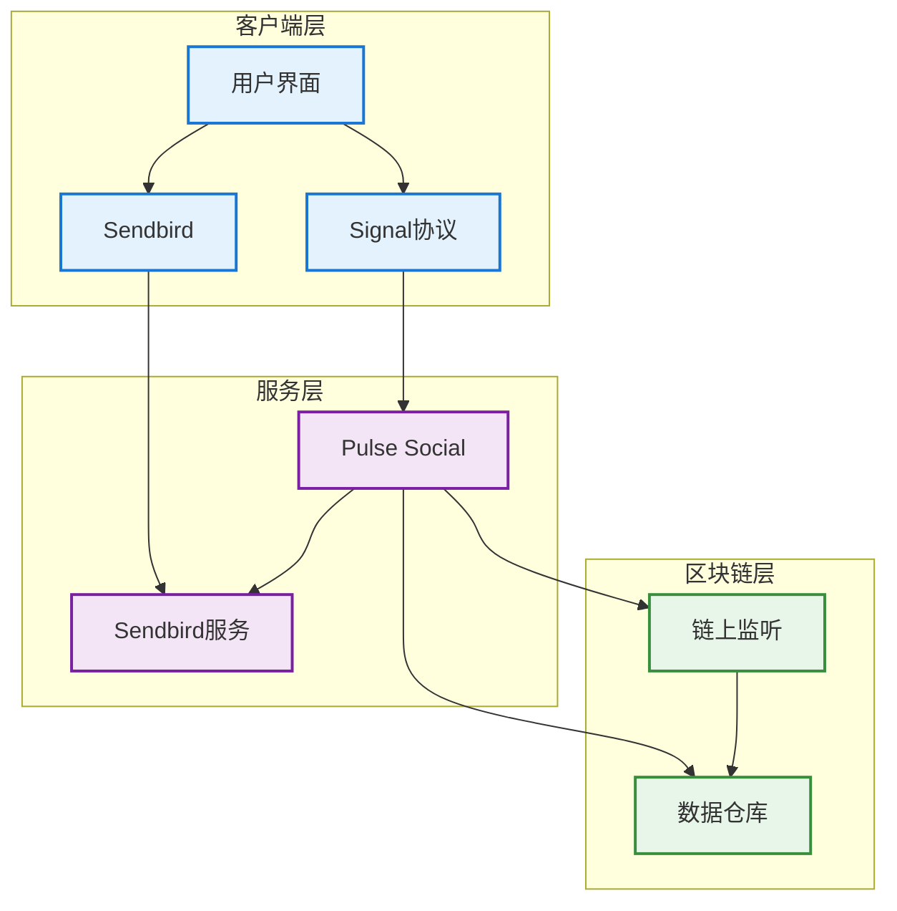
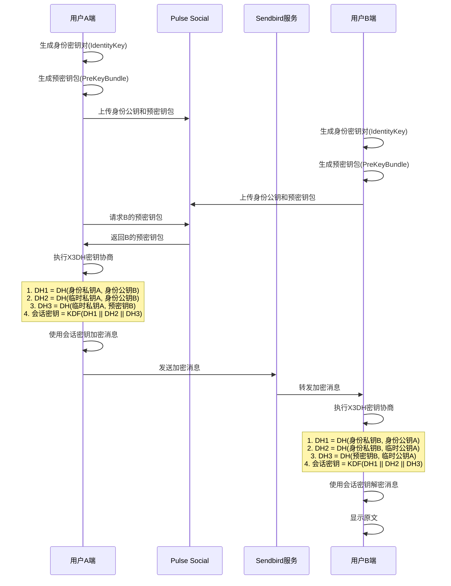
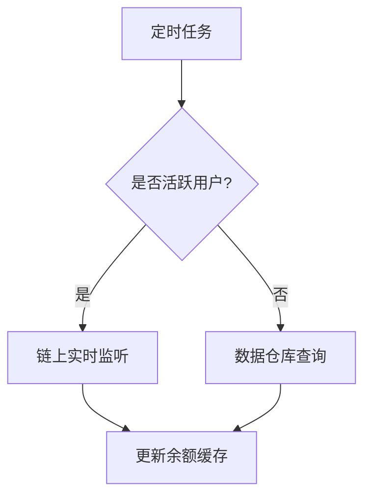
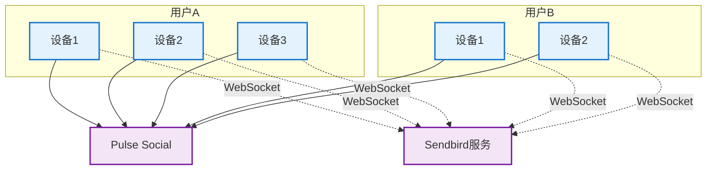
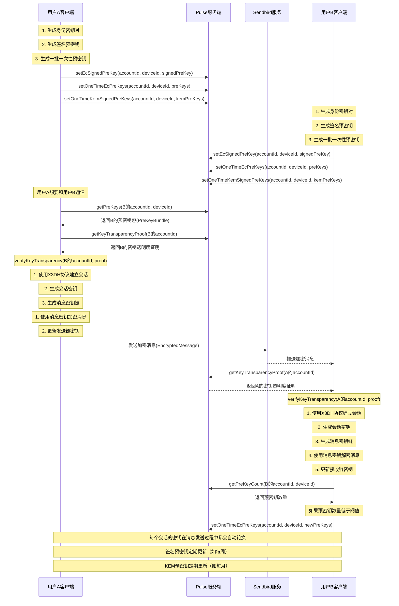

# Web3 DM聊天系统设计方案

## 1. 概述
本文档描述基于Sendbird实现的Web3 DM单聊功能，集成Signal协议实现端到端加密，并支持基于用户AA钱包余额的功能。

## 2. 功能需求
- 单聊通信：通过sendbird传递秘文
- 消息端到端加密： 通过signal协议加密，后端实现公钥/预密钥分发
- 聊天列表： 群聊/单聊混排
- 单聊关系维护：
    - follow关系
    - 已有聊天：要支持是否显示控制
- 聊天发起
    - 目标用户搜索&排序
    - 新发的单聊：相当于建组和消息同时触发，接收端实时通知机制
- 用户封禁：封禁后，直接在对应senbird群组中设置禁言。
- 聊天限制：只有满足条件，才会授予在senbird群组发言的权限。
- 用户钱包余额查询
- 消息历史记录：依然从sendbird拉取，但都是秘文，无法查看，只能用作统计

## 3. 非功能需求
- 消息实时性
- 数据安全性
- 系统可用性
- 扩展性

## 4. 系统架构

### 4.1 整体架构图


### 4.2 组件说明
1. 客户端层
   - 用户界面：消息展示与交互
   - Signal协议：端到端加密
   - Sendbird：消息收发

2. 服务层
   - Pulse Social：核心业务服务
   - Sendbird服务：消息基础设施

3. 区块链层
   - 链上监听：实时数据同步
   - 数据仓库：历史数据存储


### 4.3 端加密消息通信流程


### 4.4 钱包余额查询流程


## 5. 技术方案

### 5.1 消息加密方案
- 使用Signal Protocol实现端到端加密
- 每个会话生成唯一的会话密钥
- 支持消息前向安全性
- 密钥协商使用X3DH协议

### 5.2 钱包余额监控方案
1. 实时监听：
   - 监听活跃用户的钱包地址
   - 使用WebSocket订阅链上事件
   - 实时更新余额缓存

2. 定时查询：
   - 每小时从数据仓库同步非活跃用户余额
   - 使用批量查询优化性能
   - 设置余额更新阈值


## 6. 功能设计

### 6.1 单聊通信

#### 6.1.1 多设备通信架构
Signal协议的多设备支持主要基于以下原则:
1. 每个用户可以注册多个设备
2. 每个设备都有独立的密钥对
3. 消息需要分别加密发送给接收方的每个设备
4. 每个设备独立维护自己的会话状态



#### 6.1.2 设备注册与管理
1. **设备注册流程**
   ```mermaid
   sequenceDiagram
       participant Device as 新设备
       participant Server as Pulse服务端
       participant Sendbird as Sendbird服务
       
       Device->>Server: 请求注册新设备
       Note over Device: 生成设备ID和注册ID
       Note over Device: 生成身份密钥对
       Device->>Server: 上传设备信息(deviceRegistration)
       Server->>Sendbird: 择机创建设备对应的聊天频道
       Server-->>Device: 返回注册结果
       Note over Device: 存储本地密钥
   ```
    - 择机创建设备对应的聊天频道
        - 用户使用新设备选择具体人发起聊天时
        - 用户被选择发起聊天时。(前提都是有发言的权限)

2. **设备信息收集**
   - 时机：
     * 首次安装应用时
     * 用户登录新设备时
     * 设备令牌更新时
   - 收集内容：
     * 设备唯一标识符
     * 设备类型(iOS/Android/Desktop)
     * 操作系统版本
     * 应用版本
     * 推送令牌
     * 设备注册ID

#### 6.1.3 设备安全机制
1. **密钥管理**
   - 每个设备独立生成和管理密钥
   - 密钥永不离开设备
   - 不支持密钥备份和恢复
   - 设备丢失意味着消息历史丢失

2. **设备丢失处理**
   - 远程撤销设备授权
   - 通知其他设备该设备已失效(禁用与丢失设备相关的所有频道)
   - 重新建立新的会话
   - 旧设备的消息无法恢复

3. **安全考虑**
   - 每个设备的会话独立加密
   - 不同设备间的消息互不可见
   - 设备丢失不影响其他设备的安全性

#### 6.1.4 频道信息查询接口 (getChannelInfo)
**使用场景**：当用户需要与其他用户通信时，查询对应设备的Sendbird频道信息，用于建立WebSocket连接。

| 参数 | 类型 | 说明 |
|------|------|------|
| userId | String | 用户ID |
| deviceId | String | 设备ID |
| targetUserId | String | 目标用户ID |
| targetDeviceId | String | 目标设备ID |
| 返回值 | ChannelInfo | 频道信息响应 |

ChannelInfo 对象字段说明：
```json
{
    "applicationId": "Sendbird应用ID",
    "channelUrl": "频道URL",
    "imUserId": "设备对应的Sendbird用户ID",
    "sessionToken": "访问令牌",
    "targetImUserId": "目标设备的Sendbird用户ID",
    "customType": "频道类型标识",
    "metadata": {
        "encryptionEnabled": true,
        "deviceInfo": {
            "deviceId": "目标设备ID",
            "deviceType": "设备类型"
        }
    }
}
```

#### 6.1.5 设备注册接口 (deviceRegistration)
**使用场景**：用户在新设备上首次使用应用时，需要注册设备信息。

| 参数 | 类型 | 说明 |
|------|------|------|
| userId | String | 用户ID |
| deviceInfo | DeviceInfo | 设备信息对象 |
| 返回值 | DeviceRegistrationResponse | 设备注册响应 |

DeviceInfo 对象字段说明：
```json
{
    "deviceId": "设备唯一标识符",
    "deviceType": "设备类型(iOS/Android/Desktop)",
    "osVersion": "操作系统版本",
    "appVersion": "应用版本号",
    "pushToken": "推送通知令牌",
    "registrationId": "Signal协议注册ID"
}
```

DeviceRegistrationResponse 对象字段说明：
```json
{
    "deviceId": "已注册的设备ID",
    "registrationStatus": "注册状态",
    "linkedDevices": [{
        "deviceId": "关联设备ID",
        "deviceType": "设备类型",
        "lastActiveAt": "最后活跃时间"
    }]
}
```

#### 6.1.6 消息传输流程
1. **建立连接**
   ```mermaid
   sequenceDiagram
       participant Device as 发送方设备
       participant Server as Pulse服务端
       participant Sendbird as Sendbird服务
       participant Target as 接收方设备
       
       Device->>Server: getChannelInfo(userId, deviceId, targetId, targetDeviceId)
       Server-->>Device: 返回频道信息
       Device->>Sendbird: 建立WebSocket连接
       
       Target->>Server: getChannelInfo(targetId, targetDeviceId, userId, deviceId)
       Server-->>Target: 返回频道信息
       Target->>Sendbird: 建立WebSocket连接
   ```

2. **消息发送流程**
   - 发送方获取接收方所有活跃设备列表
   - 对每个目标设备：
     * 使用目标设备的公钥加密消息
     * 通过对应的Sendbird频道发送加密消息
   - 接收方设备：
     * 监听各自的Sendbird频道
     * 使用自己的私钥解密消息
     * 本地存储解密后的消息

3. **实现细节**
   - 每个设备独立维护会话状态
   - 消息通过Sendbird WebSocket实时推送
   - 服务端不存储任何密钥和消息明文
   - 频道信息按需查询，不做本地持久化

#### 6.1.7 安全考虑
1. **密钥安全**
   - 私钥仅存在于设备本地
   - 不提供密钥备份功能
   - 设备丢失意味着消息不可恢复

2. **消息安全**
   - 端到端加密
   - 每个设备独立加密
   - 完美前向保密
   - 防止重放攻击

3. **设备安全**
   - 设备认证和授权
   - 可疑设备检测
   - 设备数量限制
   - 非活跃设备清理

4. **传输安全**
   - WebSocket TLS加密
   - 消息签名验证
   - 会话保护
   - 频道访问控制

### 6.2 消息端到端加密
- 通过signal协议加密，后端实现公钥/预密钥分发
- 下图展示了两个用户之间建立加密通信的完整流程：



#### 6.2.1 获取预密钥包 (getPreKeys)
**使用场景**：当用户A想要与用户B开始加密通信时，需要先获取用户B的预密钥包，用于建立安全的通信会话。通常在首次通信或会话密钥需要更新时调用。

| 参数 | 类型 | 说明 |
|------|------|------|
| targetIdentifier | ServiceIdentifier | 目标用户的服务标识符，包含身份类型和UUID |
| deviceId | Optional<uint32> | 设备ID，如果不指定则返回所有设备的预密钥包 |
| 返回值 | GetPreKeysResponse | 预密钥包响应对象 |

GetPreKeysResponse 对象字段说明：
```json
{
    "identityKey": "目标用户的身份公钥",
    "preKeys": {
        "deviceId": {
            "ecSignedPreKey": {
                "keyId": "签名预密钥ID",
                "publicKey": "签名预密钥公钥",
                "signature": "签名"
            },
            "ecOneTimePreKey": {
                "keyId": "一次性EC预密钥ID",
                "publicKey": "一次性EC预密钥公钥"
            },
            "kemOneTimePreKey": {
                "keyId": "KEM预密钥ID",
                "publicKey": "KEM预密钥公钥",
                "signature": "签名"
            }
        }
    }
}
```

#### 6.2.2 获取预密钥数量 (getPreKeyCount)
**使用场景**：服务器需要定期检查用户的可用预密钥数量，当数量低于阈值时通知客户端生成新的预密钥。这是确保系统始终有足够的预密钥可用的关键监控接口。

| 参数 | 类型 | 说明 |
|------|------|------|
| accountId | String | 账户ID，要查询的目标用户 |
| deviceId | int | 设备ID，指定查询哪个设备的预密钥数量 |
| identityType | IdentityType | 身份类型（ACI或PNI） |
| 返回值 | PreKeyCount | 包含EC和KEM预密钥数量的对象 |

#### 6.2.3 设置一次性EC预密钥 (setOneTimeEcPreKeys)
**使用场景**：当用户首次注册设备或预密钥数量不足时，客户端会生成一批新的EC预密钥并上传到服务器。支持批量设置以提高效率。

| 参数 | 类型 | 说明 |
|------|------|------|
| identityType | IdentityType | 身份类型（ACI或PNI） |
| preKeys | List<EcPreKey> | EC预密钥列表 |
| 返回值 | SetPreKeyResponse | 设置结果响应 |

EcPreKey 对象字段说明：
```json
{
    "keyId": "预密钥ID",
    "publicKey": "EC公钥",
    "privateKey": "EC私钥（仅客户端保存）"
}
```

#### 6.2.4 设置EC签名预密钥 (setEcSignedPreKey)
**使用场景**：用户需要定期更新EC签名预密钥以增强安全性。与一次性预密钥不同，签名预密钥可以重复使用，但建议定期轮换（如每周）。

| 参数 | 类型 | 说明 |
|------|------|------|
| identityType | IdentityType | 身份类型（ACI或PNI） |
| signedPreKey | EcSignedPreKey | EC签名预密钥对象 |
| 返回值 | SetPreKeyResponse | 设置结果响应 |

EcSignedPreKey 对象字段说明：
```json
{
    "keyId": "签名预密钥ID",
    "publicKey": "EC公钥",
    "signature": "使用身份密钥对公钥的签名"
}
```

#### 6.2.5 设置一次性KEM预密钥 (setOneTimeKemSignedPreKeys)
**使用场景**：为支持后量子加密，用户需要设置一批KEM（密钥封装机制）预密钥。这些预密钥提供抗量子计算攻击的能力。支持批量设置。

| 参数 | 类型 | 说明 |
|------|------|------|
| identityType | IdentityType | 身份类型（ACI或PNI） |
| preKeys | List<KemSignedPreKey> | KEM签名预密钥列表 |
| 返回值 | SetPreKeyResponse | 设置结果响应 |

KemSignedPreKey 对象字段说明：
```json
{
    "keyId": "KEM预密钥ID",
    "publicKey": "KEM公钥",
    "signature": "使用身份密钥的签名"
}
```

注意事项：
1. KEM预密钥使用后量子安全的算法（如Kyber-1024）
2. 每个KEM预密钥只能使用一次
3. 服务端需要维护KEM预密钥的使用状态
4. 建议的参数设置：
   - 批量上传大小：20个
   - 最小可用数量阈值：5个

#### 6.2.6 获取密钥透明度证明 (getKeyTransparencyProof)
**使用场景**：当用户需要验证其他用户的身份密钥是否可信时使用。这通常发生在首次通信或检测到对方密钥变更时，用于防止中间人攻击。

| 参数 | 类型 | 说明 |
|------|------|------|
| accountId | String | 账户ID，要获取证明的目标用户 |
| 返回值 | KeyTransparencyProof | 密钥透明度证明对象 |

KeyTransparencyProof 对象字段说明：
```json
{
    "accountId": "账户ID",
    "keyHistory": [{
        "identityKey": "历史身份公钥",
        "timestamp": "使用时间戳"
    }],
    "proof": {
        "merkleRoot": "Merkle树根哈希",
        "merkleProof": "Merkle包含性证明",
        "signature": "服务器签名"
    }
}
```

#### 6.2.7 验证密钥透明度证明 (verifyKeyTransparency)
**使用场景**：收到其他用户的密钥透明度证明后，需要验证其有效性。这是确保通信安全的关键步骤，可以检测是否存在恶意的密钥替换。

| 参数 | 类型 | 说明 |
|------|------|------|
| accountId | String | 账户ID，要验证证明的用户 |
| proof | KeyTransparencyProof | 待验证的密钥透明度证明 |
| 返回值 | boolean | 验证结果：true-有效，false-无效 |

#### 6.2.8 发送加密消息(走sendbird订阅，这里只是例子)
**使用场景**：用户A要向用户B发送加密消息时调用。消息在客户端使用会话密钥加密后，通过该接口发送给服务器。

| 参数 | 类型 | 说明 |
|------|------|------|
| accountId | String | 接收方账户ID |
| deviceId | int | 接收方设备ID |
| message | EncryptedMessage | 加密后的消息对象 |
| 返回值 | void | 无返回值 |

EncryptedMessage 对象字段说明：
```json
{
    "messageId": "消息唯一标识",
    "senderId": "发送者账户ID",
    "senderDeviceId": "发送者设备ID",
    "ciphertext": "加密后的消息内容",
    "messageType": "消息类型（文本/图片/文件等）",
    "timestamp": "发送时间戳",
    "ephemeralKey": "临时公钥（如果使用）",
    "messageNumber": "消息序号（用于防重放）"
}
```

#### 6.2.9 接收加密消息(走sendbird订阅，这里只是例子)
**使用场景**：用户B定期检查或实时获取发送给自己的加密消息。获取到的消息需要使用对应的会话密钥在客户端解密。

| 参数 | 类型 | 说明 |
|------|------|------|
| accountId | String | 接收方账户ID |
| deviceId | int | 接收方设备ID |
| 返回值 | List<EncryptedMessage> | 加密消息列表 |

以上接口共同构成了完整的端到端加密消息传输体系：
1. 通过预密钥管理（6.2.1-6.2.5）确保安全的密钥交换
2. 使用密钥透明度证明（6.2.6-6.2.7）保证密钥的可信度
3. 实现加密消息的发送和接收（6.2.8-6.2.9）

错误处理：
所有接口可能抛出的异常包括：
```json
{
    "KeyNotFoundException": "请求的密钥不存在",
    "KeyValidationException": "密钥验证失败",
    "DeviceNotFoundException": "指定的设备不存在",
    "QuotaExceededException": "超出配额限制",
    "InvalidParameterException": "参数无效",
    "AuthenticationException": "身份验证失败",
    "ServerException": "服务器内部错误"
}
```

### 6.3 聊天列表
 群聊/单聊混排
 现有接口改造

### 6.4 单聊关系维护
- follow关系
    - follow接口
    - unfollow接口
- 已有聊天：要支持是否显示控制
    - 删除单聊

### 6.5 聊天发起
- 目标用户搜索&排序
- 新发的单聊：相当于建组和消息同时触发，接收端实时通知机制

### 6.6 用户封禁
封禁后，直接在对应senbird群组中设置禁言。

### 6.7 聊天限制
只有满足条件，才会授予在senbird群组发言的权限。

### 6.8 用户钱包余额查询

### 6.9 消息历史记录
依然从sendbird拉取，但都是秘文，无法查看，只能用作统计


