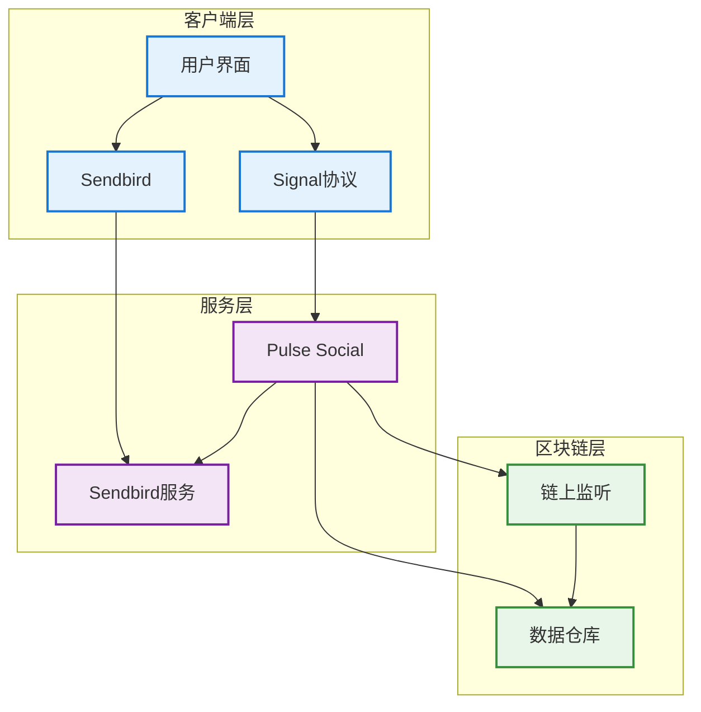
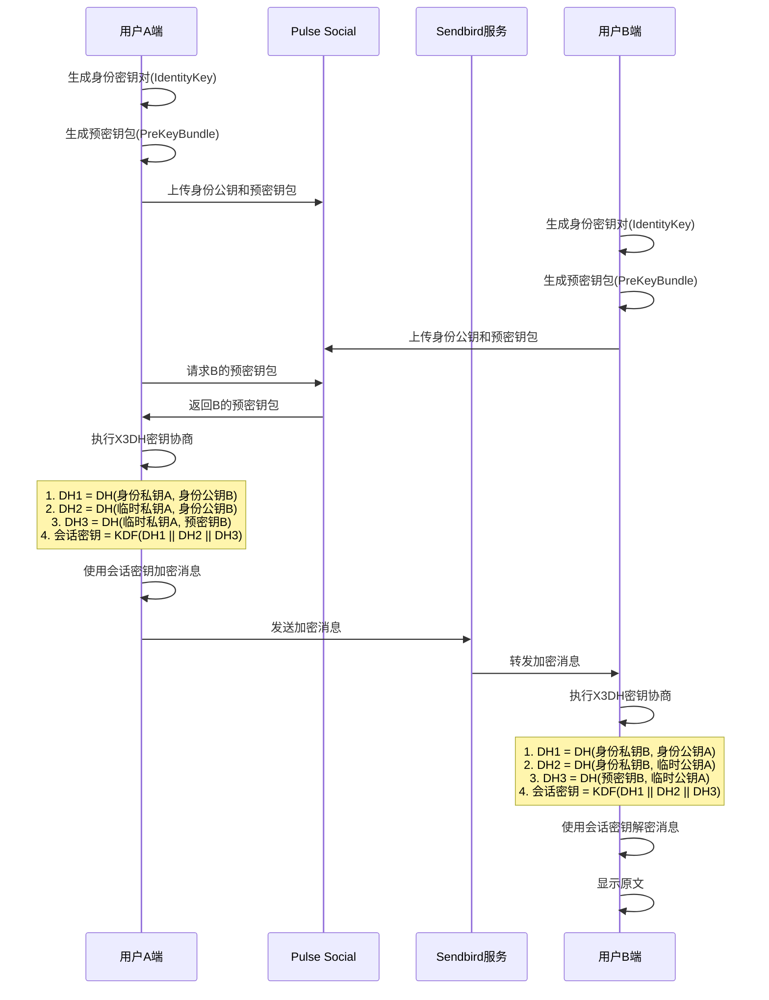
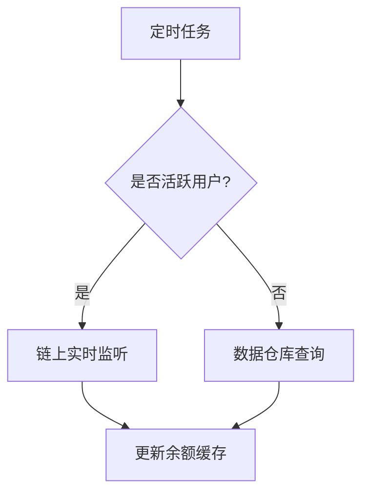

# Web3 DM聊天系统设计方案

## 1. 概述
本文档描述基于Sendbird实现的Web3 DM单聊功能，集成Signal协议实现端到端加密，并支持基于用户AA钱包余额的功能。

## 2. 功能需求
- 单聊通信：通过sendbird传递秘文
- 消息端到端加密： 通过signal协议加密，后端实现公钥/预密钥分发
- 聊天列表： 群聊/单聊混排
- 单聊关系维护：
    - follow关系
    - 已有聊天：要支持是否显示控制
- 聊天发起
    - 目标用户搜索&排序
    - 新发的单聊：相当于建组和消息同时触发，接收端实时通知机制
- 用户封禁：封禁后，直接在对应senbird群组中设置禁言。
- 聊天限制：只有满足条件，才会授予在senbird群组发言的权限。
- 用户钱包余额查询
- 消息历史记录：依然从sendbird拉取，但都是秘文，无法查看，只能用作统计

## 3. 非功能需求
- 消息实时性
- 数据安全性
- 系统可用性
- 扩展性

## 4. 系统架构

### 4.1 整体架构图


### 4.2 组件说明
1. 客户端层
   - 用户界面：消息展示与交互
   - Signal协议：端到端加密
   - Sendbird：消息收发

2. 服务层
   - Pulse Social：核心业务服务
   - Sendbird服务：消息基础设施

3. 区块链层
   - 链上监听：实时数据同步
   - 数据仓库：历史数据存储


### 4.3 端加密消息通信流程


### 4.4 钱包余额查询流程


## 5. 技术方案

### 5.1 消息加密方案
- 使用Signal Protocol实现端到端加密
- 每个会话生成唯一的会话密钥
- 支持消息前向安全性
- 密钥协商使用X3DH协议

### 5.2 钱包余额监控方案
1. 实时监听：
   - 监听活跃用户的钱包地址
   - 使用WebSocket订阅链上事件
   - 实时更新余额缓存

2. 定时查询：
   - 每小时从数据仓库同步非活跃用户余额
   - 使用批量查询优化性能
   - 设置余额更新阈值


## 6. 功能设计

### 6.1 单聊通信
- 通过sendbird传递秘文
- 本次在senbird新增application，和之前的群里区分开来
- 单聊组信息获取接口
    - 入参
        - 目标用户ID
    - 出参
        - channel_url
### 6.2 消息端到端加密
 - 通过signal协议加密，后端实现公钥/预密钥分发
 - 核心接口定义如下：

#### 6.2.1 获取预密钥包
**使用场景**：当用户A想要与用户B开始加密通信时，需要先获取用户B的预密钥包，用于建立安全的通信会话。通常在首次通信或会话密钥需要更新时调用。

| 参数 | 类型 | 说明 |
|------|------|------|
| accountId | String | 账户ID，用于唯一标识目标用户 |
| deviceId | int | 设备ID，用于支持用户多设备登录场景 |
| 返回值 | PreKeyBundle | 预密钥包对象 |

PreKeyBundle 对象字段说明：
```json
{
    "registrationId": "设备注册ID",
    "deviceId": "设备ID",
    "identityKey": "身份公钥",
    "signedPreKey": {
        "keyId": "签名预密钥ID",
        "publicKey": "签名预密钥公钥",
        "signature": "签名"
    },
    "oneTimePreKey": {
        "keyId": "一次性预密钥ID",
        "publicKey": "一次性预密钥公钥"
    }
}
```

#### 6.2.2 获取预密钥数量
**使用场景**：服务器需要定期检查用户的可用预密钥数量，当数量低于阈值时通知客户端生成新的预密钥。这是确保系统始终有足够的预密钥可用的关键监控接口。

| 参数 | 类型 | 说明 |
|------|------|------|
| accountId | String | 账户ID，要查询的目标用户 |
| deviceId | int | 设备ID，指定查询哪个设备的预密钥数量 |
| 返回值 | int | 可用的预密钥数量，当数量低于阈值(如20个)时应该生成新的预密钥 |

#### 6.2.3 设置预密钥
**使用场景**：当用户首次注册设备或预密钥数量不足时，客户端会生成一批新的预密钥并上传到服务器。这些预密钥将用于后续与其他用户建立加密通信。

| 参数 | 类型 | 说明 |
|------|------|------|
| accountId | String | 账户ID，预密钥所属的用户 |
| deviceId | int | 设备ID，预密钥所属的设备 |
| preKeys | List<PreKey> | 预密钥列表 |
| 返回值 | void | 无返回值 |

PreKey 对象字段说明：
```json
{
    "keyId": "预密钥ID，用于唯一标识该预密钥",
    "publicKey": "预密钥公钥",
    "privateKey": "预密钥私钥（仅客户端保存）"
}
```

#### 6.2.4 设置签名预密钥
**使用场景**：用户需要定期更新签名预密钥以增强安全性。与一次性预密钥不同，签名预密钥可以重复使用，但建议定期轮换（如每周或每月）。

| 参数 | 类型 | 说明 |
|------|------|------|
| accountId | String | 账户ID，签名预密钥所属的用户 |
| deviceId | int | 设备ID，签名预密钥所属的设备 |
| signedPreKey | SignedPreKey | 签名预密钥对象 |
| 返回值 | void | 无返回值 |

SignedPreKey 对象字段说明：
```json
{
    "keyId": "签名预密钥ID",
    "publicKey": "签名预密钥公钥",
    "privateKey": "签名预密钥私钥（仅客户端保存）",
    "signature": "使用身份密钥对公钥的签名",
    "timestamp": "创建时间戳"
}
```

#### 6.2.5 设置 KEM 预密钥
**使用场景**：为支持后量子加密，用户需要设置 KEM（密钥封装机制）预密钥。这些密钥在量子计算机出现后仍能保持安全性。通常在设备初始化和定期更新时设置。

| 参数 | 类型 | 说明 |
|------|------|------|
| accountId | String | 账户ID，KEM预密钥所属的用户 |
| deviceId | int | 设备ID，KEM预密钥所属的设备 |
| kemPreKey | KEMSignedPreKey | KEM签名预密钥对象 |
| 返回值 | void | 无返回值 |

KEMSignedPreKey 对象字段说明：
```json
{
    "keyId": "KEM预密钥ID",
    "publicKey": "KEM公钥",
    "privateKey": "KEM私钥（仅客户端保存）",
    "signature": "使用身份密钥的签名",
    "algorithm": "使用的KEM算法（如Kyber-1024）",
    "timestamp": "创建时间戳"
}
```

#### 6.2.6 获取密钥透明度证明
**使用场景**：当用户需要验证其他用户的身份密钥是否可信时使用。这通常发生在首次通信或检测到对方密钥变更时，用于防止中间人攻击。

| 参数 | 类型 | 说明 |
|------|------|------|
| accountId | String | 账户ID，要获取证明的目标用户 |
| 返回值 | KeyTransparencyProof | 密钥透明度证明对象 |

KeyTransparencyProof 对象字段说明：
```json
{
    "accountId": "账户ID",
    "identityKey": "当前身份公钥",
    "timestamp": "证明生成时间戳",
    "merkleRoot": "Merkle树根哈希",
    "merkleProof": "Merkle包含性证明",
    "signature": "服务器签名",
    "previousProofs": ["历史证明记录"],
    "revocationStatus": "密钥是否已被撤销"
}
```

#### 6.2.7 验证密钥透明度证明
**使用场景**：收到其他用户的密钥透明度证明后，需要验证其有效性。这是确保通信安全的关键步骤，可以检测是否存在恶意的密钥替换。

| 参数 | 类型 | 说明 |
|------|------|------|
| accountId | String | 账户ID，要验证证明的用户 |
| proof | KeyTransparencyProof | 待验证的密钥透明度证明 |
| 返回值 | boolean | 验证结果：true-有效，false-无效 |

#### 6.2.8 发送加密消息(走sendbird订阅，这里只是例子)
**使用场景**：用户A要向用户B发送加密消息时调用。消息在客户端使用会话密钥加密后，通过该接口发送给服务器。

| 参数 | 类型 | 说明 |
|------|------|------|
| accountId | String | 接收方账户ID |
| deviceId | int | 接收方设备ID |
| message | EncryptedMessage | 加密后的消息对象 |
| 返回值 | void | 无返回值 |

EncryptedMessage 对象字段说明：
```json
{
    "messageId": "消息唯一标识",
    "senderId": "发送者账户ID",
    "senderDeviceId": "发送者设备ID",
    "ciphertext": "加密后的消息内容",
    "messageType": "消息类型（文本/图片/文件等）",
    "timestamp": "发送时间戳",
    "ephemeralKey": "临时公钥（如果使用）",
    "messageNumber": "消息序号（用于防重放）"
}
```

#### 6.2.9 接收加密消息(走sendbird订阅，这里只是例子)
**使用场景**：用户B定期检查或实时获取发送给自己的加密消息。获取到的消息需要使用对应的会话密钥在客户端解密。

| 参数 | 类型 | 说明 |
|------|------|------|
| accountId | String | 接收方账户ID |
| deviceId | int | 接收方设备ID |
| 返回值 | List<EncryptedMessage> | 加密消息列表 |

以上接口共同构成了完整的端到端加密消息传输体系：
1. 通过预密钥管理（6.2.1-6.2.5）确保安全的密钥交换
2. 使用密钥透明度证明（6.2.6-6.2.7）保证密钥的可信度
3. 实现加密消息的发送和接收（6.2.8-6.2.9）

错误处理：
所有接口可能抛出的异常包括：
```json
{
    "KeyNotFoundException": "请求的密钥不存在",
    "KeyValidationException": "密钥验证失败",
    "DeviceNotFoundException": "指定的设备不存在",
    "QuotaExceededException": "超出配额限制",
    "InvalidParameterException": "参数无效",
    "AuthenticationException": "身份验证失败",
    "ServerException": "服务器内部错误"
}
```
### 6.3 聊天列表
 群聊/单聊混排
### 6.4 单聊关系维护
    - follow关系
    - 已有聊天：要支持是否显示控制
### 6.5 聊天发起
    - 目标用户搜索&排序
    - 新发的单聊：相当于建组和消息同时触发，接收端实时通知机制
### 6.6 用户封禁
封禁后，直接在对应senbird群组中设置禁言。
### 6.7 聊天限制
只有满足条件，才会授予在senbird群组发言的权限。
### 6.8 用户钱包余额查询
### 6.9 消息历史记录
依然从sendbird拉取，但都是秘文，无法查看，只能用作统计


## 7. 安全考虑
- 消息全程加密
- 私钥本地存储
- 定期轮换会话密钥
- 防重放攻击
- 钱包地址验证

## 8. 性能优化
- 消息缓存策略
- 余额查询批处理
- 链上事件过滤
- 连接池管理
- 数据预加载

## 9. 部署方案
- 使用容器化部署
- 多区域部署
- 负载均衡
- 故障转移
- 监控告警

## 10. 后续规划
- 群聊支持
- 富媒体消息
- 消息回执
- 更多钱包集成
- 性能优化


